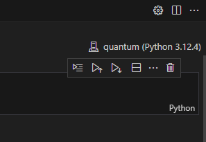

# jupyter vscode 설정
```bash
pip3 install jupyter
pip3 install ipykernel
pip3 install qiskit-ibm-runtime
pip3 install qiskit[visualization]
pip3 install qiskit-aer

pip3 install qiskit_ibm_provider

```

```bash
conda create -n quantum
conda activate quantum

python -m ipykernel install --user --name quantum --display-name quantum
```
- Kernel 확인


# IntroductiontoQuantumComputingwithIBMQuantumExperience

- IBM 계정 등록 및 계정확인
- https://quantum-computing.ibm.com/


```bash
conda create -n quantum
conda activate quantum

# pip3 install qiskit
pip3 install 'qiskit>=1' jupyterlab pandas matplotlib
pip3 install pylatexenc

```